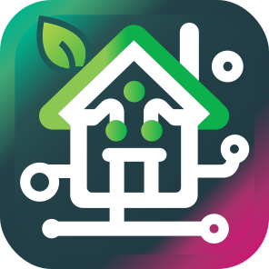

<!-- markdownlint-disable MD033 -->

# &nbsp;&nbsp;&nbsp;Matterbridge dynamic platform example plugin

---

Matterbridge dynamic platform example plugin is a template to develop your own plugin using the dynamic platform.

It exposes 58 virtual devices:

- a door contact sensor
- a motion sensor
- an illuminance sensor
- a temperature sensor
- an humidity sensor
- a pressure sensor
- a flow sensor
- a climate sensor with temperature, humidity and pressure
- a mode select device
- a switch with onOff cluster
- a light with onOff
- a light with onOff and levelControl (dimmer)
- a light with onOff, levelControl and colorControl (with XY, HS and CT) clusters
- a light with onOff, levelControl and colorControl (with HS and CT) clusters
- a light with onOff, levelControl and colorControl (with XY and CT) clusters
- a light with onOff, levelControl and colorControl (with CT only) clusters
- an outlet (plug) with onOff cluster
- a cover with windowCovering cluster and lift feature
- a cover with windowCovering cluster and both lift and tilt features
- a lock with doorLock cluster
- a thermostat auto mode (i.e. with Auto Heat and Cool features) with thermostat cluster and 3 sub endpoints with flowMeasurement cluster, temperatureMeasurement cluster
  and relativeHumidityMeasurement cluster (to show how to create a composed device with sub endpoints)
- a thermostat with auto mode (i.e. with Auto Heat and Cool features), occupancy and outdoorTemperature
- a thermostat heat only with two external temperature sensors (tagged like Indoor and Outdoor)
- a thermostat cool only
- a fan with Off High presets
- a fan with Off Low Med High presets
- a fan with Off Low Med High Auto presets and step
- a fan with all the features MultiSpeed, Auto, Step, Rock, Wind and AirflowDirection and mode Off Low Med High Auto.
- a rainSensor device
- a waterFreezeDetector device
- a waterLeakDetector device
- a smokeCoAlarm (with smoke and co features) sensor (supported by Apple Home)
- a smokeCoAlarm (with smoke only feature) sensor (supported by Apple Home)
- a smokeCoAlarm (with co only feature) sensor (supported by Apple Home)
- an airConditioner device
- an airPurifier device with temperature and humidity sensor (supported by Apple Home)
- a pumpDevice device
- a waterValve device
- an airQuality device with all concentration measurements clusters (supported by Apple Home with the concentration measurements from version 18.5)
- a momentary switch composed by three switches with Single Double Long (tagged with One Two Three and Top Middle Bottom) and three switches with Single only.
- a latching switch
- a Robot Vacuum Cleaner device (supported by SmartThings, Alexa, Home Assistant and partially by Apple Home). Read also <https://github.com/Luligu/matterbridge/discussions/264>.
- a onOff Mounted Switch device (supported by SmartThings, Alexa, Home Assistant)
- a dimmer Mounted Switch device (supported by SmartThings, Alexa, Home Assistant)
- a laundry Washer device (supported by SmartThings, Alexa and Home Assistant)
- a laundry Dryer device (supported by SmartThings, Alexa and Home Assistant)
- a dishwasher device (supported by SmartThings, Alexa and Home Assistant)
- a refrigerator device (supported by SmartThings, Alexa and Home Assistant)
- an oven device (supported by SmartThings, Alexa and Home Assistant)
- a microwave Oven device (supported by SmartThings, Alexa and Home Assistant)
- an extractor Hood device (supported by SmartThings, Alexa and Home Assistant)
- a cooktop device (supported by SmartThings, Alexa and Home Assistant)
- a water heater device (supported by SmartThings and Home Assistant)
- a car charger device (supported by Home Assistant)
- a solar power device
- a battery storage device
- a heat pump device
- a speaker device (supported by SmartThings)

All these devices continuously change state and position. The plugin also shows how to use all the command handlers (you can control all the devices), how to subscribe to attributes and how to trigger events.

If you want to write your plugin, the easiest way to start create a new plugin is to clone the [Matterbridge Plugin Template](https://github.com/Luligu/matterbridge-plugin-template) which has **Dev Container support for instant development environment** and all tools and extensions (like Node.js, npm, TypeScript, ESLint, Prettier, Jest and Vitest) already loaded and configured.

If you like this project and find it useful, please consider giving it a star on GitHub at <https://github.com/Luligu/matterbridge-example-dynamic-platform> and sponsoring it.

## Prerequisites

### Matterbridge

See the guidelines on [Matterbridge](https://github.com/Luligu/matterbridge/blob/main/README.md) for more information.

## Style guide

See also the [Style Guide](./STYLE_GUIDE.md) for JSDoc, naming and logging conventions used in this repository.
